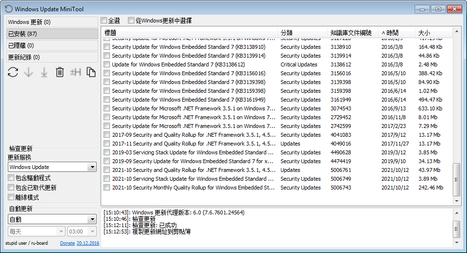

下载WindowsUpdateMiniTool.txt和net48.txt中的全部文件

安装.NET Framework 4.8及其补丁
```
ndp48-x86-x64-enu_0885a72554ca76d2cd3ad76f98878f22b6a1d0b2.exe
ndp48-kb4503575-x86_78fea8088b0dbdd3384d248eda91b538b8ca3345.exe
ndp48-kb4532941-x86_19370dea90744c58926b12d239c99134d068a13d.exe
ndp48-kb5006060-x86_38da0ba9c6b1f13672ce933b8eae7f61c4c80325.exe
```

安装系统补丁（运行完每个cmd都重启一次系统）
```
install1.cmd
install2.cmd
install3.cmd
```
